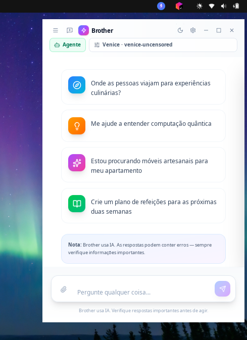

# Brother Assistant

> **🌐 Idioma / Language:** [English](README.md) · [Português](#) · [Español](README.es.md)

Assistente de IA nativo para Linux com janela própria, system tray e atalho global. Sem dependência de terminal.

<p align="center">
  
</p>

## Funcionalidades

- **Chat com streaming** — Respostas em tempo real com Markdown, syntax highlight e blocos de código copiáveis
- **Multi-provedor** — GitHub Copilot, OpenAI, Venice, Groq, OpenRouter, Gemini, xAI, Custom (Ollama/LM Studio)
- **Modo Agente** — Executa ações no PC: criar/editar/excluir arquivos, abrir apps, pesquisar na web, organizar pastas e gerar imagens
- **Entrada por voz e TTS** — Ditado por microfone para prompts e leitura em voz alta das respostas do assistente
- **Arrastar arquivos** — Drag & drop de PDF, DOCX, TXT e imagens direto no chat
- **Histórico de conversas** — Persistido localmente com exportação para Markdown
- **Dark mode** — Tema claro/escuro com toggle
- **System tray** — Minimiza para a bandeja com menu de contexto
- **Atalho global** — `Super+Shift+B` para abrir/esconder a janela de qualquer lugar
- **Autostart** — Opção de iniciar com o sistema (XDG autostart)
- **Pesquisa web** — Busca no DuckDuckGo e traz resultados dentro do chat
- **Multi-idioma** — 11 idiomas: English, Português, Español, Русский, 日本語, 中文, العربية, Deutsch, Français, Italiano, हिन्दी
- **Rotação de contas** — Múltiplas API keys com rotação automática em caso de rate limit

## Stack Técnica

| Camada | Tecnologia |
|--------|-----------|
| **Janela** | [tao](https://github.com/nickel-org/tao) + [wry](https://github.com/nickel-org/wry) (WebKitGTK) |
| **System tray** | [tray-icon](https://github.com/nickel-org/tray-icon) |
| **Atalho global** | [global-hotkey](https://github.com/nickel-org/global-hotkey) |
| **Core** | Rust (lógica de negócio, provedores, agente, streaming) |
| **Frontend** | React 18 + TypeScript + Vite + Tailwind CSS v4 |
| **IPC** | JSON postMessage via protocolo custom `brother://app/` |

## Requisitos

- Linux (Ubuntu 22.04+ recomendado)
- Node.js 18+
- Rust 1.75+
- Dependências do sistema:
  ```bash
  sudo apt install libwebkit2gtk-4.1-dev libgtk-3-dev libayatana-appindicator3-dev
  ```
- Motores opcionais de TTS para leitura em voz alta:
  ```bash
  sudo apt install espeak-ng speech-dispatcher
  ```

## Como Começar

```bash
# Instalar dependências do frontend
npm install

# Build do frontend
npm run build

# Rodar em modo dev
cargo run -p brother-shell
```

## Build Release

```bash
# Build otimizada + pacote .deb
./scripts/build-release.sh

# Ou manualmente:
npm run build
cargo build --release -p brother-shell
```

## Estrutura do Projeto

```
brother-core/    # Lógica de negócio (provedores, agente, config, streaming)
brother-shell/   # Shell nativa Linux (tao + wry + tray + hotkey)
linux-cli/       # CLI alternativa (terminal)
src/             # Frontend React (componentes, estilos, tipos)
scripts/         # Scripts de build
```

## Privacidade

- **Zero telemetria** — Nenhum dado é enviado para servidores do projeto
- **Configurações locais** — API keys e histórico ficam em `~/.config/copilot-assistente/`
- **Única comunicação externa** — A API do provedor de IA que você escolheu
- **Opção 100% offline** — Use Custom provider apontando para Ollama local

## Licença

LGPL
